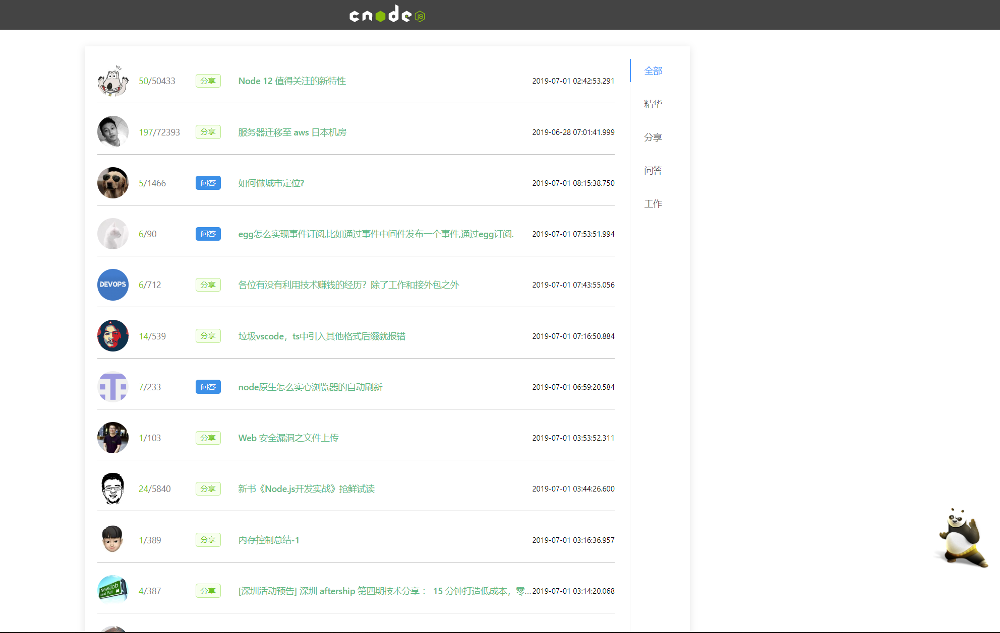
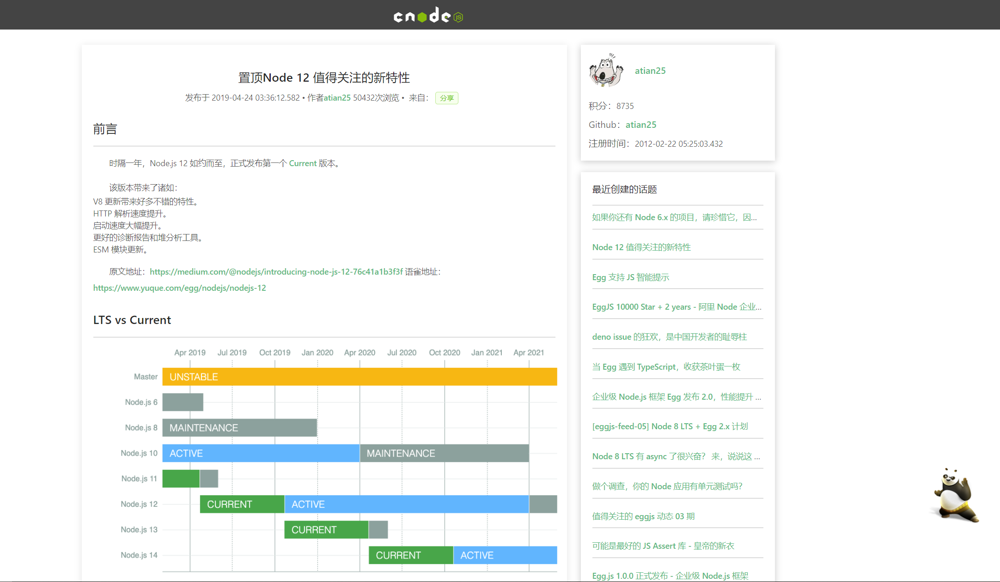

# react-cnodejs
> react(hook) 重构 CnodeJS 社区

------------------------------------------

>为什么要学习react?

```
 之前看到一篇博客，它里面有一句话到现在我都印象深刻。
 “你手里拿着锤子,看什么都像钉子。”
 我之前是vue栈。当初学习vue是因为上手快，技术文档亲人，毕竟是我们中国人创造的前端框架。
 很早之前我也看过react，学习成本太大，毕竟我是英语渣渣。
 那时候从博客到社区充斥着吐槽this问题，万能不变的setState,让人无力的生命周期。。。
 9102年 react-hook发布真的是惊喜 简单粗暴的Function组件大放光彩  没有了this setState 可控的生命周期 
 vue 和 react 各有优势 都有值得我们学习的地方
 如果你之前对react感觉很无力，浩克（hook）的到来给react带来了超能力，现在开发react就像呼吸一样自然。
 怎么样，心动了吗，心动就去了解一下hook吧,有惊喜哦
```

>之前有童鞋已经重构了一版 
>
>[ReactCnodeJS]: https://github.com/shuiRong/ReactCnodeJS
>
>  是之前Class组件开发的
>
>我是机缘巧合的情况下看到的，然后正好学完了hook就拿来练手了 当然我也借用了项目里面的一点代码 毕竟能偷懒就偷懒吗 






#### 本地运行：

```
git clone https://github.com/mySouler/react-cnodejs
cd react-cnodejs
yarn install
yarn start
```

P.S.: 默认用的是 3000 端口。

#### 技术栈：

[React](https://reactjs.org/)

[React-Router](https://reacttraining.com/react-router/web/example/basic)

[Ant Design](https://ant.design/index-cn)

[CnodeJS API](https://cnodejs.org/api)